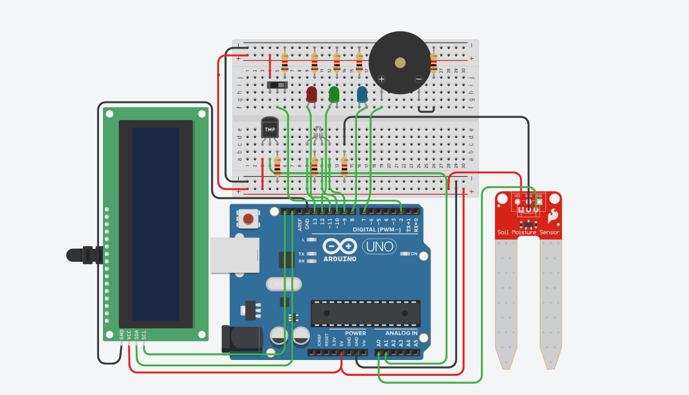

# Crop Management with Feeding Interval System

## Overview
This project implements an IoT-based automated crop management system using an ESP32 microcontroller.  
The system monitors soil moisture and temperature to assist in efficient crop feeding and management.

## System Functionality
The system operates in two modes:

### Automatic Mode
- Continuously monitors soil moisture and temperature
- Uses RGB LED indicators to represent soil conditions
- Controls output indicators based on predefined thresholds
- Buzzer remains OFF in automatic mode

### Manual Mode
- User-controlled operation using a mode switch
- Activates buzzer alerts during critical moisture conditions
- Provides visual feedback using RGB LEDs

## Components Used
- ESP32 Microcontroller
- Soil Moisture Sensor
- Temperature Sensor
- RGB LED
- LCD Display
- Buzzer
- Mode Selection Switch

## Implementation Details
- Developed using Arduino framework (C/C++)
- Structured using enums, structs, and pointers
- Dynamic memory allocation used for time logging
- Fully tested using Tinkercad simulation

## Simulation
🔗 Tinkercad Project Link (Login Required):  
https://www.tinkercad.com/things/fus4LFbUrWU-c-project

> Note: Due to Tinkercad platform restrictions, login is required to view the simulation.

## Project Structure

## Circuit Diagram

